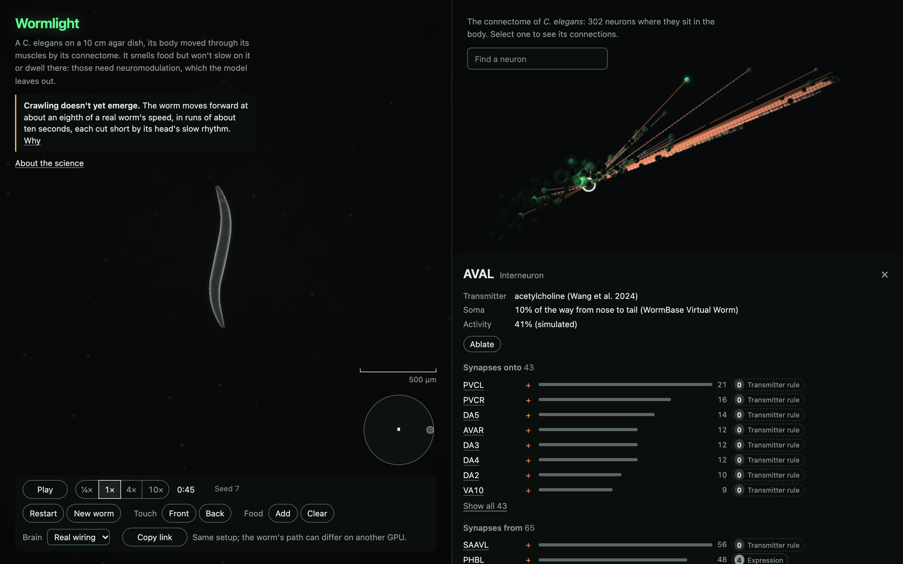

# Wormlight

A living _C. elegans_ in the browser. The worm's full connectome runs on the GPU and drives a physically simulated body on an agar plate, and its neurons glow as they activate, in the style of calcium imaging.

**Live:** https://chrisjz.github.io/wormlight/ (needs a browser with WebGPU: recent Chrome or Edge, or Safari 26 or later).



## Where it stands

**The worm crawls at the partial grade of the project's first behavioural checkpoint, paced by a rhythm in its head.** Until 2 October 2026 no fit the project's rules could choose crawled at that level, and that negative result stands for every fit before the current one.

The rule Wormlight was built under is that behaviour must emerge from the connectome: nothing scripts the worm, and the few layers allowed outside the wiring are fixed in advance and blind to what the worm is doing. Its thresholds for each behaviour were fixed in advance too, from published measurements. Against them:

- **Crawling (checkpoint 1) is partial.** On the chosen fit, the calibrated values the app runs, the worm moves forward in every trial in runs longer than twenty seconds, its undulation frequency within a real worm's range and its wavelength and speed partial, the speed about a third of a real worm's. The result holds when the simulation's time step is halved, and the checkpoint's own run repeats the grade figure for figure.
- **How it got there.** A research track, R, rebuilt and recalibrated the model in three rounds, under rules set before each ran, and found no crawler its rules could choose. A second track, S, then gave the model the synapse signs that recordings measure, a resting offset for one class of motor neuron, and gap junctions that pass current one way, as recordings show, and recalibrated it under rules set before any of it was built. Its first pick held at half the time step, so the rules made it the chosen fit. Recounted the same way, two of R's last crawlers would have held too, so the new way of counting undulations, set before S ran, may account for that as much as S's changes do.
- **The rhythm is not the network's own.** The head's rhythm generator, one of the layers the rule allows, paces the crawl at its strongest setting, the B-type motor neurons have no rhythm of their own, and the worm hardly reverses. Unlike R's last crawl, which stayed partial with the AVB command interneurons lesioned, this one barely gets anywhere without them, its backward motion nearly cancelling its forward.
- **The touch reflexes (checkpoints 2 and 3) fail.** A touch to the head of a crawling worm never made it reverse, and a touch to the tail didn't speed it up: the touch reaches the command neurons only faintly, and though it nudges the head's rhythm, the crawl carries on.
- **Chemotaxis (checkpoint 4) fails.** Worms placed between a butanone spot and a control spot reach the odour no more often than worms that can't smell it, 18 against 17 of 100. Many end up at the dish's wall, and what looked like steering towards the odour turns out to be the wall's doing.
- **The lesion effects (checkpoint 5) fail.** The intact worm never reverses, so lesions that should make it reverse less have nothing to take away. Every lesion of a command interneuron slows its crawl. The graded one that should stop forward motion, AVB and PVC together, slows it by 72%, short of the 80% asked, and cutting the backward command neurons AVA and AVD slows it about as much, so the slowing isn't specific to moving forward. Cutting AVB alone cuts its net speed by 91%, but with AVB gone, PVC sends the worm backward more often.
- **The test of whether the real wiring matters (checkpoint 6) finds no evidence that it does.** Ten brains on the same neurons, their chemical synapses rewired at random with each neuron keeping its number of them, were each tuned the same way as the real one, and nine of them crawl as well, most of them faster, all paced by the same rhythm in the head. The real wiring passes none of the later checkpoints, so they can't tell it apart either. The clearest difference, noticed rather than predicted, is AVB: cut it, and the real wiring's crawl nearly stops while the rewired brains' carry on.
- **The silenced network (checkpoint 0) passes again**, and still says little: the head's rhythm generator, which carries the crawl, stays shut once the network is silenced, and the noise, though it still sets the motor neurons' own oscillators off and bends the body, doesn't move it. With the synapse signs that are uncertain set otherwise, crawling stays partial under five of ten random draws and falls short of partial's speed under the other five, where on the earlier fit it failed every time; with those synapses silent, the worm rocks in place.

What is built and checked: a CPU reference of the whole loop, which reproduces the published network model it starts from; the same loop on the GPU, matching the reference in Chrome, in Safari and on CI; the app, with touch, food, lesions and a rewired contrast brain, at 60 frames a second up to at least 20 times real time in Chrome and Safari on an Apple M5 Max; and a ledger of how well biology supports every part. [VALIDATION.md](VALIDATION.md) has the results in full, and [DECISIONS.md](DECISIONS.md) how each was reached.

## The science in brief

**The hypothesis.** That the measured wiring of the worm's nervous system, run through a standard model of its neurons and a small, documented set of mechanisms the wiring can't supply, is enough for its behaviour to emerge. The app lets a viewer test the wiring's part of that, though on the chosen fit little of the worm's motion comes from the wiring: lesion a neuron, or swap the real wiring for one rewired at random, and watch what changes.

**The model.**

- **The wiring** is the adult hermaphrodite's: 302 neurons, 3,709 chemical connections and 1,095 gap-junction pairs, with 956 connections onto 95 body-wall muscles, from serial-section electron microscopy (Cook et al. 2019, as corrected in Emmons 2024).
- **The neurons** are graded, not spiking, as most of the worm's are: leaky membranes joined by gap junctions and by chemical synapses with a sigmoidal activation (Kunert et al. 2014). A synapse's strength is taken as proportional to its size in the micrographs. Its sign is inferred, not measured: from transmitter and receptor expression for 46% of connections (Fenyves et al. 2020), from the transmitter alone for 38%, and with no basis, so no fast effect, for 14%; 51 rest on physiology.
- **Five layers sit outside the wiring**, the only ones the rule allows, each set by one rule for every cell of a class and shared by every brain:
  1. sensing: one olfactory neuron, AWC-ON, smelling butanone with an adapting threshold, and the gentle-touch receptors;
  2. proprioception: the body's curvature fed back to the motor neurons the literature names;
  3. intrinsic rhythm: oscillators in the A- and B-type motor neurons, and a relaxation switch in the head. Which cells generate the worm's rhythm is unsettled, and this is one documented hypothesis, not a finding (Ji et al. 2021; Fouad et al. 2018; Gao et al. 2018; Wen et al. 2012);
  4. the step from motor neurons to muscle activation;
  5. seeded noise in each neuron.
- **The body** is two-dimensional: 49 rods joined by springs and dampers and bent by dorsal and ventral muscles, pushing against agar by anisotropic drag (Boyle, Berri & Cohen 2012). Nothing moves the worm but that.
- **The dish** is a 10 cm plate. Food lawns release butanone, which spreads through the air above the agar by diffusion.

**What the model leaves out.** Neuromodulation and all signalling outside synapses: dopamine, serotonin, tyramine, octopamine and the neuropeptides. With them go the food behaviours that depend on them, so the worm smells food but will not slow on it (Sawin, Ranganathan & Horvitz 2000) or dwell there (Flavell et al. 2013). Also left out: every sense but butanone and gentle touch; the pharynx and feeding; spikes, plateaus and differences between cell types, but for one class's resting offset; rectifying gap junctions, but for AVA's with the A-type motor neurons; variation between animals, development and learning.

**The guards against faking it.**

- With every connection between neurons cut, crawling, the touch reflexes and chemotaxis must all disappear (checkpoint 0).
- Parameters are global or set by one rule per class of neuron, never tuned neuron by neuron: 18 are free, 12 of them calibrated, and only against crawling, the earlier fits also against the rate of spontaneous reversals. The other checkpoints are held out.
- Every threshold was fixed before its results, and every change since is logged and marked.
- Every graded quantity is labelled as a calibration target or a prediction.

[FIDELITY.md](FIDELITY.md), and "About the science" in the app, grade every part from measured in the worm down to assumed.

## Using the app

- **The plate.** Play and pause, and run at ¼×, 1×, 4× or 10× real time. Restart runs the same worm again, and New worm draws another. Click the worm, or use Touch's Front and Back, to touch it. Food's Add drops a lawn where you next click. Zoom out until a lawn looks small to move it: drag it, or click it to pick it up and click again to put it down; dragged off the dish, it is removed. Closer in, a drag pans. Clear removes them all. Scroll to zoom; double-click to follow the worm again.
- **The connectome.** Drag to turn it, scroll to zoom, and click a neuron, or find one by name, to see its connections, its simulated activity and where each fact comes from. Ablate lesions the neuron, live; Restore brings it back, and Restore all every one. Colour by switches between the glow and the neurons' classes.
- **Brain** swaps the real wiring for one of ten random rewirings of its chemical synapses, live and untuned: the contrast brain.
- **Copy link** copies a link to the setup: the worm's seed, the food, the brain and the lesions, with the versions of the model and data it was made with. A link reproduces the setup, not the path: on another GPU the worm's path can differ.

A link's main parameters, all optional:

| Parameter               | What it sets                                                                   |
| ----------------------- | ------------------------------------------------------------------------------ |
| `seed=4`                | The worm: its heading, its noise, and which AWC is ON                          |
| `food=10,0;-20,5`       | The lawns, in millimetres from the dish's centre; empty for none               |
| `brain=rewired-3`       | The contrast brain's rewiring, 1 to 10                                         |
| `lesions=AVAL+AVAR`     | The neurons lesioned                                                           |
| `model=2&data=333bf768` | The versions the link was made with; the app says so if its own differ         |
| `view=plate`, `graph`   | One view alone                                                                 |
| `t=30`, `paused=1`      | Run the worm this many seconds before the first frame, up to 600; start paused |
| `speed=20`              | How many times real time the worm runs, up to 100; the buttons stop at 10×     |
| `neuron=AVAL`           | The neuron selected                                                            |
| `colour=class`          | The graph coloured by class, not by the glow                                   |
| `about=science`         | "About the science" open                                                       |
| `stats=1`               | The frame rate and the worm's speed, shown                                     |

## Run it

Needs Node 22.22.1 or later (or 23.6 or later), and a browser with WebGPU.

```sh
npm install
npm run dev        # the app, at the address it prints
npm test           # unit tests
npm run build      # typecheck and bundle into dist/
```

The rest, from the data build to the behavioural harness and GPU parity, is listed with what each does in [CLAUDE.md](CLAUDE.md).

## The documents

| Document                                 | What it holds                                                                |
| ---------------------------------------- | ---------------------------------------------------------------------------- |
| [WORMLIGHT_SPEC.md](WORMLIGHT_SPEC.md)   | The contract the project was built to                                        |
| [PLAN.md](PLAN.md)                       | The design, with every threshold fixed in advance                            |
| [VALIDATION.md](VALIDATION.md)           | The checkpoints' results, their methods and the known simplifications        |
| [FIDELITY.md](FIDELITY.md)               | How well biology supports each part, generated from the registry in the code |
| [DATA_SOURCES.md](DATA_SOURCES.md)       | Every dataset, with its citation and licence                                 |
| [DECISIONS.md](DECISIONS.md)             | The log of every significant choice, its reasons and what it found           |
| [docs/sign-audit.md](docs/sign-audit.md) | An audit of the command circuit's synapse signs against the literature       |
| [docs/spec-audit.md](docs/spec-audit.md) | An audit of the repository against the spec, requirement by requirement      |

## Citing

To cite Wormlight, use "Cite this repository" on its GitHub page, which reads [CITATION.cff](CITATION.cff), and give the version you used. Please cite the connectome too, [Cook et al. 2019](https://doi.org/10.1038/s41586-019-1352-7) as released in [Emmons 2024](https://doi.org/10.1371/journal.pbio.3002939), and the works the synapse signs come from, [Fenyves et al. 2020](https://doi.org/10.1371/journal.pcbi.1007974) and [Wang et al. 2024](https://doi.org/10.7554/eLife.95402).

Releases are numbered from 0.1.0 and published under the repository's [Releases](https://github.com/chrisjz/wormlight/releases). The live site runs `main`, which can be ahead of the latest release, so About the science names the version it was built after and the commit it runs.

## Credits

Connectome: [Cook et al. 2019](https://doi.org/10.1038/s41586-019-1352-7), _Nature_ 571:63, as released in [Emmons 2024](https://doi.org/10.1371/journal.pbio.3002939), _PLoS Biol_ 22:e3002939 (CC BY 4.0). Neurotransmitter identities: [Wang et al. 2024](https://doi.org/10.7554/eLife.95402), _eLife_ 13:RP95402. Exported via [Quantum Nematode](https://github.com/SyntheticBrains/nematode). Synapse signs: [Fenyves et al. 2020](https://doi.org/10.1371/journal.pcbi.1007974), joined by Wormlight's own data build.

## Licence

The code is Apache-2.0 (see [LICENSE](LICENSE)). Bundled data keeps its original licences and attribution requirements: see [DATA_SOURCES.md](DATA_SOURCES.md), and [public/data/NOTICE.md](public/data/NOTICE.md), which ships with the site.
