# Wormlight: what a connectome-driven worm does, and why it does no more

Chris Julian Zaharia · written for Wormlight 0.3.0 · model version 2, data version 333bf768 · October 2026

This report gives Wormlight's research from its question to its conclusion, the negative results with the rest. `VALIDATION.md` holds every result in full, generated from the trials, and `DECISIONS.md` how each step was decided, with its date. The report cites both by date, so any statement here can be traced to its record.

## Summary

Wormlight runs the adult hermaphrodite _C. elegans_ connectome (Cook et al. 2019, as corrected in Emmons 2024) through a graded neuron model (Kunert, Shlizerman & Kutz 2014) and drives a physically simulated body on agar, live in a browser on the GPU. Its rule is that behaviour must emerge from the wiring. Only five kinds of mechanism may sit outside the network, each the same for every cell of a class and blind to what the worm is doing. Seven behavioural checkpoints, with thresholds from published measurements, were fixed before any result, and every later change to them is logged.

- **Crawling emerges at the first checkpoint's partial grade, paced from outside the network.** After a planned model that didn't crawl and three rounds of recalibration that found no crawler the rules could choose, a model with measured synapse signs crawls at a third of a real worm's speed, under a count of undulations changed after earlier results. The rhythm comes from a relaxation switch in the head, one of the permitted mechanisms. Switch it off and the worm doesn't move.
- **The touch reflexes, chemotaxis and the lesion effects all fail.** The worm almost never reverses, and a touch to its head reaches the backward command interneuron AVA by about 1 mV.
- **The wiring test finds no evidence that the real wiring matters.** Nine of ten degree-preserving rewirings, each tuned by the same procedure, crawl as well, most of them faster.
- **A diagnosis traces the missing reversal partly to the model class and partly to the fit's motor layer.** In this graded synapse model, about 95% of excitatory chemical synapses can't relay a small voltage change at unit gain from the network's rest, constants no calibrated parameter changes. On the fits tried, the motor layer has no backward mode: driving AVA directly by 44 mV never made the worm reverse, and strengthening every synapse makes things worse.

The research closes at that documented conclusion: under its rules, a touch reversal doesn't emerge in this model. The simulator, its validation suite and its records are the durable outputs.

## 1. The question

The worm's nervous system has been mapped synapse by synapse, and a recurring hope is that the map is enough: run the wiring through a reasonable model of its neurons, couple it to a body, and the worm's behaviour should follow. Wormlight tests that hope strictly, in a model that is open, cheap to run and visible. A worm that crawls convincingly for the wrong reasons would count as a failure.

The wiring diagram alone can't produce the worm's behaviour, and the rule needs a boundary. Rhythm generation in the motor circuit relies on oscillating neurons and proprioceptive feedback (Ji et al. 2021; Fouad et al. 2018; Gao et al. 2018; Wen et al. 2012). Chemotaxis relies on sensory adaptation (Levy & Bargmann 2020). Signals measured propagating through living worms also depart from what the wiring predicts (Randi et al. 2023). So the question Wormlight asks is narrower. Given the measured wiring, a standard graded model of its neurons, and a small, documented set of mechanisms the wiring can't supply, which behaviours emerge, and does the real wiring do better than a random one?

## 2. The rules

The project's specification (`WORMLIGHT_SPEC.md`) fixed the rules before any code was written. The ones that shaped the results:

- **Five layers may sit outside the network:**
  - sensory transduction and adaptation;
  - proprioception, into the classes the literature names;
  - intrinsic dynamics, only where a source documents them for a class;
  - neuromuscular transfer;
  - per-neuron noise.

  Each is the same for every cell of a class, cited, shared by every brain, and blind to behavioural state: nothing outside the network may read "reversing" or "near food". Neuromodulation is out of scope.

- **Parameters are global or set per class,** never per neuron unless a source gives a per-neuron value. The budget allows 18 free parameters, of which 12 are calibrated.
- **Calibration sees crawling only.** The calibration targets are checkpoint 1's kinematics, and for the earlier fits the spontaneous reversal rate. Checkpoints 2 to 5 are held out and run with parameters frozen. If a held-out result prompts a change, that checkpoint is reported as fitted.
- **Thresholds are fixed in advance** in `PLAN.md` §7. A change after results is logged in `DECISIONS.md` with its reason, and the checkpoint is marked as changed (section 8 lists them).
- **The CPU reference is the ground truth.** Every behavioural trial runs on a double-precision CPU implementation. The GPU, which the app runs, is checked against it.

The checkpoints:

| Checkpoint          | Asks                                                                                                                                                                                            |
| ------------------- | ----------------------------------------------------------------------------------------------------------------------------------------------------------------------------------------------- |
| 0: silenced network | With every synapse and gap junction between neurons cut, crawling, both touch reflexes and chemotaxis disappear                                                                                 |
| 1: crawling         | Frequency and wavelength on agar (Fang-Yen et al. 2010) and speed (Ramot et al. 2008), posture variance in four eigenworms (Stephens et al. 2008), and forward bouts of 20 s                    |
| 2: anterior touch   | A reversal within 2 s after at least 70% of touches to the head during forward crawling, at least 3 times as often as after sham-touched twins and significantly so (Chalfie et al. 1985)       |
| 3: posterior touch  | Forward speed over the 2 s after a touch to the tail at least 10% above a sham-touched twin's, significantly so                                                                                 |
| 4: chemotaxis       | A chemotaxis index of at least 0.6 to butanone in Bargmann, Hartwieg & Horvitz's 1993 layout, above a control that can't smell                                                                  |
| 5: lesions          | Five lesions, AVA + AVD, AVB + PVC, PVC, AVA and RIM, each moving behaviour in the reported direction by a stated amount (Chalfie et al. 1985; Gray, Hill & Bargmann 2005; Piggott et al. 2011) |
| 6: wiring test      | Ten rewired brains, each tuned by the real wiring's procedure, gated on checkpoint 1, and compared with it on checkpoints 2 to 5                                                                |

## 3. The model

**The wiring.** It has 302 neurons, 3,709 chemical connections and 1,095 gap-junction pairs, with 956 connections onto 95 body-wall muscles. Its source is serial-section electron microscopy (Cook et al. 2019, as released with corrections in Emmons 2024), exported from the sister project Quantum Nematode with every input pinned by hash. A synapse's conductance is proportional to its size in sections.

**The neurons** are graded, not spiking, after Kunert, Shlizerman & Kutz 2014, as Neural Interactome implements them (Kim, Leahy & Shlizerman 2019):

- Each is a leaky membrane, joined to its partners by gap junctions and by chemical synapses.
- A synapse's activation follows its presynaptic voltage through a sigmoid, with rise and decay rates a_r = 1 s⁻¹ and a_d = 5 s⁻¹ (Kunert-Graf et al. 2017) and the sigmoid's width from Wicks, Roehrig & Rankin 1996.
- Each neuron's threshold is set at its rest, so every synapse rests at the sigmoid's midpoint, but for track S's D-types, which rest 7.4 mV above threshold.
- A port check drives Neural Interactome's own code and matches it.

**The synapse signs.**

- **From expression:** 46% of chemical connections take their sign from transmitter and receptor expression (Fenyves et al. 2020).
- **From the transmitter alone:** 38% fall back to the project's transmitter rule, applied to Wang et al. 2024's transmitter identities.
- **No basis:** 14%, which carry no fast effect.
- **From physiology:** 51 (1.4%), seven from Chalasani et al. 2007 and 44 from track S's audit of the literature. Each of S's rests on a recording of the postsynaptic cell under a manipulation targeted at the presynaptic one.

**The layers outside the network:**

- **Sensing:** AWC-ON smells butanone through Levy & Bargmann's adaptive threshold. The gentle-touch receptors take a current where a touch lands.
- **Proprioception:** the body's curvature, fed to the B-type motor neurons from the region in front (Wen et al. 2012), to the A-types from the region behind as a hypothesis (Gao et al. 2018), and read by the head switch in the SMDs (Yeon et al. 2018).
- **Rhythm:**
  - FitzHugh–Nagumo oscillators on the A- and B-type motor neurons (Gao et al. 2018; Fouad et al. 2018; FitzHugh 1961; Nagumo, Arimoto & Yoshizawa 1962).
  - A relaxation switch in the SMD head motor neurons, after Ji et al.'s 2021 model of the head as the primary rhythm generator. The switch flips when a proprioceptive signal crosses a threshold. It acts only while the network drives the SMDs above a threshold θ_osc, so a silenced network has no head rhythm.
  - Which cells generate the worm's rhythm is unsettled, and this is one documented hypothesis.
- **Neuromuscular transfer:** each muscle's drive taken relative to its own range before one shared transfer. This was a deviation from the specification, signed off on 2026-09-27.
- **Noise:** a coloured, seeded current in every neuron.

**The body** is two-dimensional, 49 rods bent by dorsal and ventral muscles against agar's anisotropic drag (Boyle, Berri & Cohen 2012). The dish is a 10 cm plate, its odour field solved by diffusion.

**What the model leaves out:**

- neuromodulation and all extrasynaptic signalling;
- every sense but butanone and gentle touch;
- spikes and plateau potentials;
- variation between animals;
- learning.

Every part carries a fidelity level and its sources in a machine-readable registry. `FIDELITY.md` is generated from it, and the app shows it.

**The fit the app runs, track S's.** On top of track R's model (section 4), track S added:

- **the measured signs** above;
- **a resting offset:** the D-type motor neurons rest 7.4 mV above their thresholds, the measured difference;
- **one-way junctions:** AVA's 37 gap junctions with the A-type motor neurons pass current only from an A-type into AVA, as Liu et al. 2017 recorded for three of them and S assumes for the rest.

Its twelve calibrated parameters, among them the head switch's and proprioception's conductances, the oscillators' excitability and the noise, were fitted on crawling alone.

## 4. How the work went

- **The go/no-go (2026-09-26).** The planned model, with its parameters drawn 96 times over wide ranges, never crawled: its best speed was 0.021 body lengths per second, against checkpoint 1's partial floor of 0.06. Neither of the first two fallbacks changed that. The maintainer chose to close that milestone as an honest partial and open a research track.
- **Track R (2026-09-27 to 2026-09-29)** built a new model and recalibrated it over three rounds.
  - The model added relative neuromuscular drive and three gains: the B-types' own oscillator gain, a gain on their gap junctions, and one on the SMDs' junctions with the rear muscles. The refit added a coloured noise, and the third round a conductance form of the head switch and proprioception.
  - Its refit failed checkpoint 1, at 0.029 body lengths per second.
  - Exploratory searches found partial crawlers, but each was either outside what the rules could choose, or its result moved when the time step was halved.
  - By a rule set in advance, only a fit whose result holds at half the step can be chosen. R's chosen fit, the refit, held there and failed checkpoint 1, so R ended without a crawler it could choose. Until track S, the headline was that crawling, as checkpoint 1 asks for it, didn't emerge.
- **Track S (2026-10-01 to 2026-10-02)** gave R's model the measured signs, the D-types' offset and AVA's rectified junctions, under rules set before any of it was built; an offset for the A-types was dropped during the build, since it would have put their thresholds above the excitatory reversal potential. Its first pick held at half the step, so the rules made it the chosen fit, and it grades partial. A new way of counting undulations may account for that as much as S's changes do. It was set before S ran, but it was itself a change after results, chosen knowing that a looser band would pass three of R's last four crawlers (`DECISIONS.md`, 2026-10-01). Recounted that way, two of them would have held at half the step (`DECISIONS.md`, 2026-10-02).
- **Checkpoints 0 to 6 on S's fit (2026-10-02 to 2026-10-08)** then ran by their protocols.
- **The diagnosis (2026-10-03)** explained why none of the later checkpoints saw a touch-evoked reversal. A linear analysis, track D0, read the network's own dynamics.

## 5. Results

### 5.1 Crawling: partial, paced by the head

On S's fit, over 20 trials of 120 s from real worms' postures, checkpoint 1 grades partial:

| Clause                              | Measured | Pass      | Grade   |
| ----------------------------------- | -------- | --------- | ------- |
| Frequency (Hz)                      | 0.217    | 0.20–0.45 | Pass    |
| Wavelength (body lengths)           | 0.48     | 0.50–0.80 | Partial |
| Speed (body lengths per second)     | 0.068    | 0.12–0.30 | Partial |
| Posture variance in four eigenworms | 97.5%    | ≥ 85%     | Pass    |
| Trials with a 20 s forward bout     | 100%     | ≥ 80%     | Pass    |

The worm moves forward in every trial nearly all the time, at 31% of a real worm's 0.22 body lengths per second (Ramot et al. 2008). Over 200 trials a step, each measure's 95% interval for the difference between steps of 2.5 and 1.25 ms lies within its margin, so the result doesn't depend on the numerics.

The rhythm is not the network's own:

- **The head switch's gate is open on every step**, the network's drive sitting 13.6 mV above θ_osc, and it cycles at 0.214 Hz, beside the body's 0.210.
- **With the switch off, the worm doesn't move.**
- **The B-types have no rhythm of their own.** The calibration took their oscillator gain to 0, and with them lesioned the worm still moves forward 63% of the time.

The calibration's speed target was 0.15, from Fang-Yen et al.'s wave speed and Karbowski et al. 2006's ratio of speed to wave speed, and the fit's speed sits at 46% of it. The eigenworm clause measures how worm-like the postures are, not whether the worm crawls: with the uncertain signs silenced, the worm rocking in place, it still passes.

The worm hardly reverses: none in checkpoint 1's trials, and 2 in the step comparison's 200, about 0.0055 a minute against a real worm's 1.8 (Gray, Hill & Bargmann 2005). Since S's calibration had no reversal term, that rate is a prediction, and it misses.

### 5.2 The silenced network: passes, and says little

With every connection between neurons cut, the worm makes no forward sample. Its head switch stays shut, the silenced drive 13.3 mV below θ_osc. The noise still sets the A-types' oscillators off and bends the body, but doesn't move it. A touch can't reach a muscle, since the touch receptors have no neuromuscular junctions. No worm reached either odour spot in an hour.

The pass says little, for two reasons:

- the threshold θ_osc's lower bound is set so that a silenced head switch stays shut;
- the touch and chemotaxis clauses mean something only beside passes of checkpoints 2 to 4, which fail.

### 5.3 The touch reflexes: fail

The touch trials used the same protocol for both checkpoints:

- **the trials:** 50 worms touched once each during forward crawling;
- **the copies:** each forked into a copy touched at the head, a copy touched at the tail, and a sham-touched twin.

**Checkpoint 2:** none of the 50 anterior touches was followed by a reversal, nor any twin. It is reported as fitted, since track S was proposed after previews of it.

**Checkpoint 3:** a posterior touch left the worm 0.3% slower than its twin, where a pass needs 10% faster.

A touch moves its receptors about 10 mV but AVA by about 1 mV. It shifts the head switch's timing, moving each touched copy's speed by −17% to +25% against its twin, but on average the speed doesn't move, and the crawl the switch paces carries on.

### 5.4 Chemotaxis: fails

Of 100 worms run for up to an hour in Bargmann, Hartwieg & Horvitz's layout, 18 reached the butanone spot and 14 the control, an index of 0.04. The same worms with AWC-ON's input off scored 0.03, a one-sided Fisher's p of 0.50.

The reversals the worms made over the hour, 0.41 a minute, are collisions with the dish's wall: every worm that reversed had reached it. Weathervaning, one of the two mechanisms the checkpoint reports beside its grade, clears its rule. But it rests on about 1% of the transitions, nearly all at the wall, where even the worms that can't smell curve inwards. Nothing shows the odour steering a worm. Klinokinesis, the other mechanism, is absent, and is reported as fitted, since it counts reversals.

### 5.5 Lesions: fail

None of checkpoint 5's five rows passes, and it is reported as fitted. The intact worm made no reversal in its 30 trials of 120 s, so the rows asking a lesion to make reversals fewer have nothing to fall from.

**AVB + PVC:** cutting these, the row that asks forward speed to fall by 80%, slows the worm by 72%.

**Not specific to forward motion:** every lesion of a command interneuron slows the crawl. AVA + AVD's slows it by 74%, as much as the forward row's.

**AVB alone,** beside the rows and not graded: cutting it cuts the worm's net speed by 91%, but the worm keeps moving about half the time, backward in 17% of the samples, as PVC sends it backward more often.

### 5.6 The wiring test: no evidence that the wiring matters

Checkpoint 6 asks whether the real wiring does better than random wiring given the same chance.

**The nulls.** Each of ten degree-preserving rewirings of the chemical synapses is a port of Quantum Nematode's double-edge swap. Each neuron keeps its numbers of signed and unsigned inputs and outputs, and the gap junctions stay as they are.

**Their tuning.** Each null was tuned by track S's own procedure, the one that found the real wiring's fit:

- the same starts, seeds and budget;
- a box of parameter bounds set by the same rules on the null's own rest;
- its first pick taken as its fit.

Two things favour the real wiring, and so strengthen the verdict: the procedure and its starts were designed on the real wiring, and only the real wiring could go down its picks by the step comparison.

**Their grading.** A null crawls if checkpoint 1 grades it at least partial. The crawling nulls then ran checkpoints 2 to 5.

The tuning took 88 hours on an older PC, and nine of the ten crawl.

_Figure 1. Each wiring's speed on checkpoint 1, with its 95% interval over the trials, against checkpoint 1's bands and a real worm's speed. The real wiring is the slowest of the ten that crawl by its point estimate, level with rewiring 8 within their intervals. Rewiring 6, which doesn't crawl, has its head switch's drive barely above its threshold._

The verdict, by the map fixed in `PLAN.md` §7.4:

- **Crawling: no evidence that the wiring matters.** The map gives that reading when five or more nulls crawl, and the wiring matters only if two or fewer do.
- **Checkpoints 2 to 5: no evidence that the wiring matters (the real wiring doesn't pass).** The real wiring fails all four, and no crawling null passes any of them. This reading was set after the real wiring's results were known, where the map as first written read "inconclusive" (`DECISIONS.md`, 2026-10-03).

Eight of the ten nulls' fits score better than the real wiring's on the search's objective. Every crawl, the real wiring's and the nulls', is the head switch's: with it off, none moves.

_Figure 2. The share of checkpoint 1's samples each wiring spends moving forward when the head switch is off or a class is lesioned. Only AVB's lesion separates the real wiring from the nulls._

The clearest behavioural difference is AVB, which wasn't predicted. Lesioned, it leaves every crawling null partial and moving forward nearly all the time, where the real wiring falls to 30% forward. Each wiring runs at its own fit, so these runs don't separate the wiring from its fit.

The sister project's Logbook 071 offers a structural statistic: how many of the 39 A- and B-type motor neurons sit one connection from the six food sensors.

_Figure 3. The 39 A- and B-type motor neurons by hops from the nearest of the six food sensors, walking chemical synapses from their presynaptic neuron and gap junctions both ways._

The real wiring has none, as a path through interneurons implies, and reproduces Logbook 071's wild type exactly. Each null has 3 to 12, against Logbook 074's 8.0 on Quantum Nematode's matching null. The shortcuts don't track which nulls crawl. In this model the crawl doesn't run from the food sensors, so the statistic describes the graphs and grades nothing.

So on S's fit the crawl gives no evidence of depending on the real wiring: S's procedure finds a head-switch crawl in nine of ten rewired brains. That is a statement about this model and its procedure. It says nothing about whether the worm's wiring matters to the worm.

### 5.7 The uncertain signs

Sixteen settings ran on S's fit, with nothing tuned again:

- the model's own;
- the 1,959 chemical connections whose signs come from the transmitter rule or from nothing, all excitatory, all silent, or in ten random draws;
- the connections rescaled;
- S's rest offsets off, or AVA's added.

Eight of the sixteen settings would grade partial, five of the ten random draws among them. Under every draw the worm still moves forward at least 86% of the time. With the uncertain signs silent the crawl goes, and the worm rocks with the head switch. Silenced, the switch stays shut under every setting.

## 6. Why the worm doesn't reverse

None of checkpoints 2 to 5 sees a reversal evoked by touch, or a spontaneous one away from the dish's wall, so a diagnosis went looking for the reason before the research closed (`DECISIONS.md`, 2026-10-03; `data/reflex/diagnosis.json`). The diagnosis is exploratory and grades nothing.

**The synapse model has a ceiling.** In the graded network Wormlight ports, a chemical synapse's activation at steady state is a_r·φ / (a_r·φ + a_d), with φ the sigmoid of the presynaptic voltage above its threshold. Thresholds sit at rest, so every synapse rests at the sigmoid's midpoint, but for S's D-types, which rest at 0.125 with 33% to their ceiling.

_Figure 4. A synapse's steady activation, with Kunert-Graf et al.'s rates and Wicks et al.'s sigmoid. It rests at 0.091, the D-types' at 0.125, and can never exceed a_r/(a_r + a_d) = 0.167, whatever the presynaptic voltage._

**Excitatory synapses push weakly.**

- **Small driving forces.** Their reversal potential is 0 mV, 230 of the 302 neurons rest between −3 and −11 mV, and the median excitatory synapse's driving force at rest is 7 mV.
- **Below unit gain.** A millivolt at the presynaptic neuron changes an excitatory synapse's current by about 0.057 × (E − V) times its resting conductance. So a chemical relay stays below unit gain unless its driving force exceeds about 17.6 mV, which about 95% of excitatory synapses' don't.
- **Constants of the model class.** These are fixed by the model's form, and no calibrated parameter changes them.

**The touch's path is too weak.**

_Figure 5. The most each stage's synapses could move their target if every presynaptic activation rose to its ceiling, with every activation and gate held at rest and the oscillators off. Red marks AVA's synapses onto the A-types. DA4's figure rises to 1.5 mV with its junctions with AVA shut, as driving AVA shuts them. AVB has no synapse onto VB5, the B-type the diagnosis watched._

- **The front receptors** could move AVD by at most 0.025 mV, and Cook's wiring has no synapse from them onto AVA.
- **The back receptors** could move AVA by at most 0.04 mV, and AVD could move AVA by 0.32 mV.
- **What a touch does reach comes mostly through gap junctions.** With every activation held, the gap junctions carry 87% of AVD's linear response to a front touch and 61% of AVA's.

**Driving AVA doesn't reverse the worm.**

- **AVA alone.** Driving it by up to 44 mV, alone or with AVB held down, never made the worm reverse, on 10 seeds of 60 s.
- **Why the A-types barely move.**
  - S's rectifier closes AVA's gap route to the A-types by design.
  - AVA's chemical synapses could move them 1 to 5 mV at most, before the oscillators' load.
  - Their oscillators load them five to nineteen times more than their passive membranes do.
- **Driving the motor circuit directly,** with the head switch off and the B-types held down, only drifts it backward, at −0.005 body lengths per second.
- **R's refit showed the same.** The sign audit found no backward mode downstream of AVA there either (`docs/sign-audit.md`).

**Stronger synapses make it worse.** Multiplying every chemical synapse's weight by up to 30 produced no reversals. It shrank a touch's reach into AVA from 0.036 mV per millivolt at the receptor to 0.0002, for three reasons:

- the stronger synapses' resting conductance shunts the gap-junction path;
- each brain's rest drifts towards the excitatory reversal potential, collapsing the driving forces;
- the touch currents, sized for the unscaled brain, stay fixed.

**The network's own dynamics (track D0).** D0 linearised S's brain at its fixed point over 25,011 samples:

- **the sampled brains:** S's fit, the ten nulls, a Latin hypercube of 20,000 points over four oscillator parameters and 118 class-pair gains up to tenfold, and a search of 5,000;
- **no oscillation:** with the oscillators off, no sample has a growing mode in the crawl's frequency band;
- **too little reach:** a front touch reaches AVA by 0.34 mV at the median and 0.87 mV at most, every sign right, so the pathway is there, an order of magnitude too weak.

**The conclusion.** On S's fit a touch reversal doesn't emerge. Some of the reasons reach past the fit to the model class, and some were shown on fits:

- the synapse model's constants hold about 95% of excitatory relays below unit gain at the network's rests;
- none of D0's 25,011 samples, gains up to tenfold on the 118 class pairs among the motor circuit and the touch receptors, lets a touch reach AVA, linearly;
- on S's fit, strengthening every synapse makes it worse;
- on S's fit and R's refit, the motor layer has no backward mode.

Under the project's rules, a touch reversal would need a new synapse model or a backward motor layer, each a model change made knowing this result. That is where the research stops.

## 7. What it means

**For the hypothesis.** In this model, the measured wiring with a standard graded neuron model and documented intrinsic mechanisms gives a worm that crawls slowly, by a rhythm in its head, and does little else that its real counterpart does. The crawl is the permitted head switch's, and comes as readily from rewired brains. The reflexes fail partly for reasons in the synapse model's form, constants no calibrated parameter changes, and partly in a motor layer that, on the fits tried, has no backward mode. None of that shows the hypothesis false for the worm. It shows that this model class, honestly constrained, is not enough to test it.

**For whole-connectome models.** Three lessons may carry beyond Wormlight:

1. **A rhythm layer can carry the crawl.** A permitted rhythm generator can make a crawl that looks emergent while the network's part is mainly to hold the layer's gate open. Switching that layer off, lesioning whole classes and tuning nulls is what exposed it; a silenced-network check alone can pass by construction.
2. **Saturating synapses attenuate a relay.** Graded synapses with a saturating activation and thresholds at rest pass a small signal through an excitatory synapse at less than unit gain when neurons rest near the excitatory reversal potential, as about 95% of excitatory synapses here do. Any model of this family should check its relay gain before asking for reflexes.
3. **A fair wiring test is expensive, and needed.** Each null got the real wiring's procedure and budget, and the real wiring did no better. An untuned null would have flattered it: untuned on S's values, none of the ten graded partial.

**For the rules.** Holding to them made the negative results interpretable. Their cost was a worm that does less than a hand-tuned one would. Each departure from the original plan was logged and marked before its consequences were known, or disclosed where it wasn't.

## 8. Limits

- **On fits, not on the model class:** the drive and efficacy runs, the missing backward mode, the A-types' oscillator load, and the wiring test's verdict. The activation ceiling and the small excitatory driving forces are constants of the class. D0 sampled gains up to tenfold on 118 class pairs, 25,011 samples in a box of 122 dimensions, one of them unreadable.
- **The diagnosis's scope:**
  - its chain ceilings are static, at rest, with activations held;
  - its drives are constant currents at a few levels;
  - its scaled brains keep the unscaled one's touch currents;
  - D0's touch response has the oscillators off;
  - S's rectifier closes AVA's gap route to the A-types by design.
- **The wiring test:**
  - **one kind of null:** its nulls rewire only the chemical synapses; the secondary null, which rewires gap junctions too, wasn't run, by a rule changed after results;
  - **one fit per wiring:** each wiring has one fit, so differences such as AVB's can't be split between wiring and fit;
  - **an untested wiring:** the real wiring passes no checkpoint after 1, so the test can't say whether its wiring matters to those.
- **What changed after results**, each logged with its reason (`VALIDATION.md`, "What changed after results"):
  - **the model:** track R's model and the noise's form;
  - **checkpoint 1:** its wavelength measurement and its frequency's counting band;
  - **the step comparison:** it became an equivalence test;
  - **touches:** checkpoint 0's are graded against sham twins, and so are checkpoints 2 and 3's;
  - **checkpoint 6:** its verdict where the real wiring doesn't pass, and the secondary null's deferral;
  - **GPU parity:** several of its tolerances;
  - **D0:** its search's objective, changed by the maintainer after its first samples.

  Track S was proposed after previews of checkpoints 2 and 5, so its reversal-reading results, checkpoint 2, checkpoint 4's klinokinesis and checkpoint 5's reversal rows, are reported as fitted. Three scratch runs previewed the reflex diagnosis, and its script repeats them.

- **Fidelity:**
  - **signs:** only 51 synapse signs rest on physiology, and 14% of chemical connections have no basis for a sign at all;
  - **calibrated values:** three of S's twelve calibrated values sit on a bound;
  - **the head switch's form:** its form and its gate are the project's own (level 0), though the mechanism is cited.

## 9. What is reusable

- **The simulator:**
  - the whole loop, connectome to body, in a CPU reference and in WebGPU, checked against each other in Chrome, in Safari and on CI;
  - the app holds 60 frames a second up to at least 20 times real time in Chrome and Safari on an Apple M5 Max;
  - a viewer can touch the worm, place food, lesion any neuron, swap in a rewired brain, and share a link to the setup.
- **The validation suite:** seven checkpoints with fixed thresholds, a harness that runs them on the CPU reference in parallel, sham-twin touch trials, an equivalence test of the time step, and a tuned-null wiring test with its verdict map.
- **The data build:** a single runtime file merged from pinned, hashed sources. It carries signs with their provenance, a cross-check against another set of fitted weights, and a sign audit of the literature (`docs/sign-audit.md`).
- **The fidelity registry:** every component, parameter and data element with a level, its sources and an upgrade path, rendered in the app and in `FIDELITY.md`.
- **The diagnostics:** the linear analyses of D0 and of the noise's spread, and the reflex diagnosis, each reproducible from a script and a committed record.

## 10. Future work

Each item names what would justify reopening it.

- **A backward motor mode.** A go/no-go of 2 to 4 days would find whether any A-type rhythm and backward-wave mechanism makes the body reverse with S's crawl intact. It is for the maintainer to consider after 0.3.0.
- **A synapse model with measured efficacy**, if a published one fits the rules.
- **A functional-connectivity contrast** from Randi et al. 2023's atlas, in this project or the sister project. Weights from measured function would end the rule that behaviour emerges from the anatomical wiring, so it would be a contrast, not the model.
- **The B-types' segmental feedback** and a search for a crawl without the head switch, if a later model makes the network's own rhythm worth asking for again.
- **The suite as a benchmark** for other connectome models, set aside for now.

## 11. Reproducing it

Every result here comes from a committed script and record. `CLAUDE.md` lists each command with its cost.

- **Checkpoints 0 to 5:** `npm run harness -- --checkpoint <n>` reruns any of them on the CPU reference and regenerates its section of `VALIDATION.md`.
- **Checkpoint 6:** `npm run harness -- --wiring <real|N>` grades a wiring, and `-- --checkpoint 6` writes the verdict.
- **The calibrations and the step comparison:** `npm run calibrate` and `npm run equivalence` run them.
- **The diagnostics:** `node scripts/experiments/reflex/run.ts` and `node scripts/experiments/d0/run.ts`.
- **This report's figures:** `npm run docs:figures`, from the committed records. CI fails when a figure is stale.

## References

Each reference was checked against Crossref or its publisher when it entered the project's citation registry (`src/science/citations.ts`).

- Bargmann CI, Hartwieg E, Horvitz HR (1993). Odorant-selective genes and neurons mediate olfaction in _C. elegans_. _Cell 74:515–527_. doi:10.1016/0092-8674(93)80053-H
- Boyle JH, Berri S, Cohen N (2012). Gait modulation in _C. elegans_: an integrated neuromechanical model. _Frontiers in Computational Neuroscience 6:10_. doi:10.3389/fncom.2012.00010
- Chalasani SH, Chronis N, Tsunozaki M, et al. (2007). Dissecting a circuit for olfactory behaviour in _Caenorhabditis elegans_. _Nature 450:63–70_. doi:10.1038/nature06292
- Chalfie M, Sulston JE, White JG, et al. (1985). The neural circuit for touch sensitivity in _Caenorhabditis elegans_. _Journal of Neuroscience 5:956–964_. doi:10.1523/JNEUROSCI.05-04-00956.1985
- Cook SJ, Jarrell TA, Brittin CA, et al. (2019). Whole-animal connectomes of both _Caenorhabditis elegans_ sexes. _Nature 571:63–71_. doi:10.1038/s41586-019-1352-7
- Emmons SW (2024). Comprehensive analysis of the _C. elegans_ connectome reveals novel circuits and functions of previously unstudied neurons. _PLoS Biology 22:e3002939_. doi:10.1371/journal.pbio.3002939
- Fang-Yen C, Wyart M, Xie J, Kawai R, Kodger T, Chen S, Wen Q, Samuel ADT (2010). Biomechanical analysis of gait adaptation in the nematode _Caenorhabditis elegans_. _PNAS 107:20323–20328_. doi:10.1073/pnas.1003016107
- Fenyves BG, Szilágyi GS, Vassy Z, Sőti C, Csermely P (2020). Synaptic polarity and sign-balance prediction using gene expression data in the _Caenorhabditis elegans_ chemical synapse neuronal connectome network. _PLoS Computational Biology 16:e1007974_. doi:10.1371/journal.pcbi.1007974
- FitzHugh R (1961). Impulses and physiological states in theoretical models of nerve membrane. _Biophysical Journal 1:445–466_. doi:10.1016/S0006-3495(61)86902-6
- Fouad AD, Teng S, Mark JR, et al. (2018). Distributed rhythm generators underlie _Caenorhabditis elegans_ forward locomotion. _eLife 7:e29913_. doi:10.7554/eLife.29913
- Gao S, Guan SA, Fouad AD, et al. (2018). Excitatory motor neurons are local oscillators for backward locomotion. _eLife 7:e29915_. doi:10.7554/eLife.29915
- Gray JM, Hill JJ, Bargmann CI (2005). A circuit for navigation in _Caenorhabditis elegans_. _PNAS 102:3184–3191_. doi:10.1073/pnas.0409009101
- Ji H, Fouad AD, Teng S, et al. (2021). Phase response analyses support a relaxation oscillator model of locomotor rhythm generation in _Caenorhabditis elegans_. _eLife 10:e69905_. doi:10.7554/eLife.69905
- Karbowski J, Cronin CJ, Seah A, Mendel JE, Cleary D, Sternberg PW (2006). Conservation rules, their breakdown, and optimality in _Caenorhabditis_ sinusoidal locomotion. _Journal of Theoretical Biology 242:652–669_. doi:10.1016/j.jtbi.2006.04.012
- Kim J, Leahy W, Shlizerman E (2019). Neural Interactome: interactive simulation of a neuronal system. _Frontiers in Computational Neuroscience 13:8_. doi:10.3389/fncom.2019.00008
- Kunert J, Shlizerman E, Kutz JN (2014). Low-dimensional functionality of complex network dynamics: neurosensory integration in the _Caenorhabditis elegans_ connectome. _Physical Review E 89:052805_. doi:10.1103/PhysRevE.89.052805
- Kunert-Graf JM, Shlizerman E, Walker A, Kutz JN (2017). Multistability and long-timescale transients encoded by network structure in a model of _C. elegans_ connectome dynamics. _Frontiers in Computational Neuroscience 11:53_. doi:10.3389/fncom.2017.00053
- Levy S, Bargmann CI (2020). An adaptive-threshold mechanism for odor sensation and animal navigation. _Neuron 105:534–548_. doi:10.1016/j.neuron.2019.10.034
- Liu P, Chen B, Mailler R, Wang ZW (2017). Antidromic-rectifying gap junctions amplify chemical transmission at functionally mixed electrical-chemical synapses. _Nature Communications 8:14818_. doi:10.1038/ncomms14818
- Nagumo J, Arimoto S, Yoshizawa S (1962). An active pulse transmission line simulating nerve axon. _Proceedings of the IRE 50:2061–2070_. doi:10.1109/JRPROC.1962.288235
- Piggott BJ, Liu J, Feng Z, Wescott SA, Xu XZS (2011). The neural circuits and synaptic mechanisms underlying motor initiation in _C. elegans_. _Cell 147:922–933_. doi:10.1016/j.cell.2011.08.053
- Ramot D, Johnson BE, Berry TL, Carnell L, Goodman MB (2008). The Parallel Worm Tracker: a platform for measuring average speed and drug-induced paralysis in nematodes. _PLoS ONE 3:e2208_. doi:10.1371/journal.pone.0002208
- Randi F, Sharma AK, Dvali S, Leifer AM (2023). Neural signal propagation atlas of _Caenorhabditis elegans_. _Nature 623:406–414_. doi:10.1038/s41586-023-06683-4
- Stephens GJ, Johnson-Kerner B, Bialek W, Ryu WS (2008). Dimensionality and dynamics in the behavior of _C. elegans_. _PLoS Computational Biology 4:e1000028_. doi:10.1371/journal.pcbi.1000028
- Wang C, Vidal B, Sural S, et al. (2024). A neurotransmitter atlas of _C. elegans_ males and hermaphrodites. _eLife 13:RP95402_. doi:10.7554/eLife.95402
- Wen Q, Po MD, Hulme E, et al. (2012). Proprioceptive coupling within motor neurons drives _C. elegans_ forward locomotion. _Neuron 76:750–761_. doi:10.1016/j.neuron.2012.08.039
- Wicks SR, Roehrig CJ, Rankin CH (1996). A dynamic network simulation of the nematode tap withdrawal circuit: predictions concerning synaptic function using behavioral criteria. _Journal of Neuroscience 16:4017–4031_. doi:10.1523/JNEUROSCI.16-12-04017.1996
- Yeon J, Kim J, Kim DY, et al. (2018). A sensory-motor neuron type mediates proprioceptive coordination of steering in _C. elegans_ via two TRPC channels. _PLoS Biology 16:e2004929_. doi:10.1371/journal.pbio.2004929
